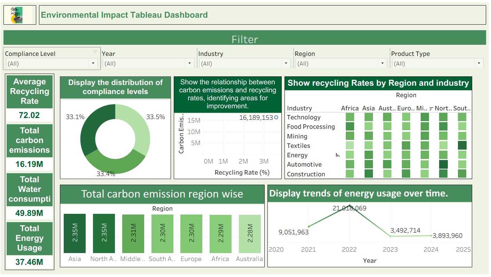

# environmental-impact-tableau-dashboard
# Environmental Impact Analytics Dashboard

## 📊 Overview

An interactive Tableau dashboard developed to analyze environmental
impact across different regions and industries.

The dashboard focuses on key environmental indicators such as
carbon emissions, energy usage, water consumption, and recycling rates.

## 🎯 Objectives

- Analyze environmental impact across regions
- Compare different industries
- Understand recycling rates
- Track energy usage over time
- Analyze carbon emissions
- Explore compliance levels

## 📌 Key Metrics

- Average Recycling Rate
- Total Carbon Emissions
- Total Water Consumption
- Total Energy Usage

## 📈 Dashboard Features

- Interactive filters
- Regional analysis
- Industry-wise comparison
- Compliance-level distribution
- Carbon emission analysis
- Energy usage trends
- Recycling rate analysis

## 🛠️ Tools Used

- Tableau
- Python
- Pandas
- Data Visualization

## 📷 Dashboard Preview

## 📂 Files

- `Environmental_Impact_Dashboard.twbx` – Tableau workbook
- `environmental_data.csv` – Dataset
- `dashboard.png` – Dashboard screenshot
